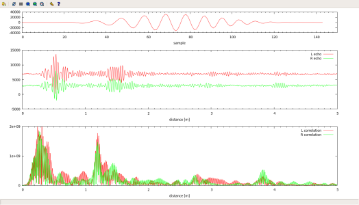

<!--- ----------------------------------------Zacatek vlastni dokumentace------------------------------- -->

# Jednoduchý sonar ze zvukovky

Program je demonstrací základních funkcí audio systému ALSA <a href="http://www.alsa-project.org/">http://www.alsa-project.org/</a>. Konkrétně je ukázkou přístupu k zařízení Playback a Capture. A zároveň jednoduchým prostředkem k prozkoumání akustických vlastností různých materiálů pouze pomocí svého počítače. :)

## Závislosti

Program je napsán pro OS Linux a testován byl konkrétně na Ubuntu.

  * Linux
  * libasound2

K přeložení programu je proto nutné mít nainstalované vývojové knihovny ALSA (libasound2-dev). Pokud máme splněné všechny závislosti, tak lze program přeložit pomocí gcc s následujícími parametry:

    gcc sonar.c -o sonar -lasound

## O co se jedná

K funkci program využije mono reproduktorový výstup. A vstup stereofonního mikrofonu. Nejdříve si vygeneruje vzorky pingu do pole, které předá ovladači zvukové karty. Následně připraví a otevře zařízení mikrofonu, aby po jeho otevření mohl spustit oba kanály zvuku současně. Tím dojde k zaznamenání vysílaného signálu i případných odražených ech do pole, které lze pak dále zpracovávat.

## Výstup

Navzorkovaná a vypočtená data jsou ukládána do textových souborů v adresáři /tmp/ ze kterého je pak možné je vykreslovat pomocí <a href="plot.gp">skriptu</a> Gnuplotu.
V horní části grafu je vysílaný signál. Uprostřed signál navzorkovaný mikrofony a dole výstup po korelaci nasnímaného signálu s odeslaným.

    ~#gnuplot
    > load "plot.gp"

Skript si sám cyklicky spouští program "sonar" a překresluje graf. Lze tak experimentovat s odrazy od různých překážek a třeba i pokračovat ve vývoji kódu.

## Zpracování dat

Zpracovaní používá pouze metodu <a href="http://en.wikipedia.org/wiki/Cross-correlation">křížové korelace</a> kterou se porovnají snímané signály vůči původnímu odeslanému pingu. Tím jsou ve výsledku velice zvýrazněna odražená echa. Celý algoritmus jsou následující dva cykly:

      for (n=0; n < (period_size - chirp_size - 1); n++)
      {
          l=0;
          r=0;
          for ( m = 0; m < chirp_size;m++)
          {
              l += chirp[m]*L_signal[m+n];	// correlate with left channel
              r += chirp[m]*R_signal[m+n];	// correlate with right channel
          }
          correlationl[n]=abs(l);
          correlationr[n]=abs(r);
      }

## Známé chyby a nedodělky

	* Ztráta amplitudy signálu - Takto jednoduchý program neuvažuje ztrátu výkonu signálu při šíření prostředím. Správně by se mělo zvyšovat zesílení vstupu mikrofonů se čtvrtou mocninou času.
	* Korektní start slinkovaného zařízení - Knihovna ALSA by podle dokumentace měla umět spojit zařízení Capture a Playback do jednoho a zacházet tak pak pouze s jedním zařízením. Toto by bylo zvlášť užitečné pro zlepšení synchronizace vstupu a výstupu. Tato možnost mi ale nefungovala na všech počítačích, proto je v tomto konkrétním kódu zakomentována.
